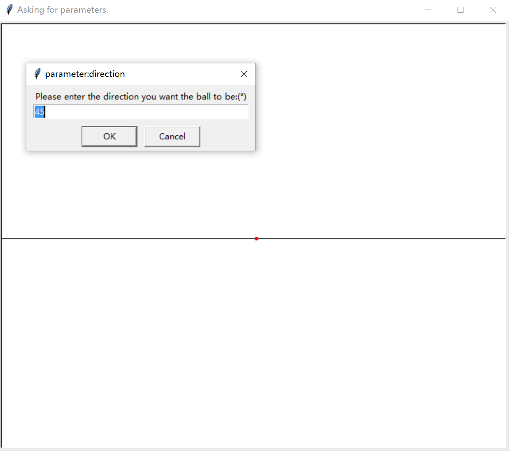
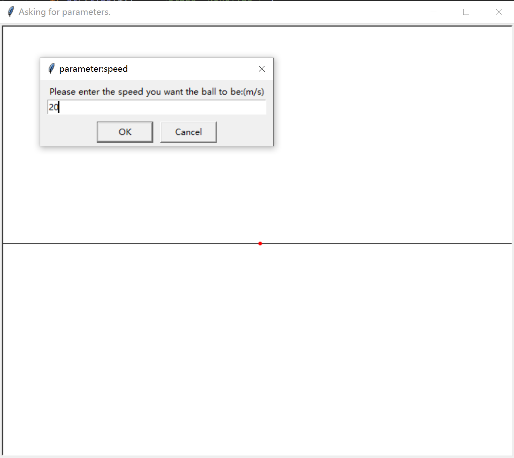
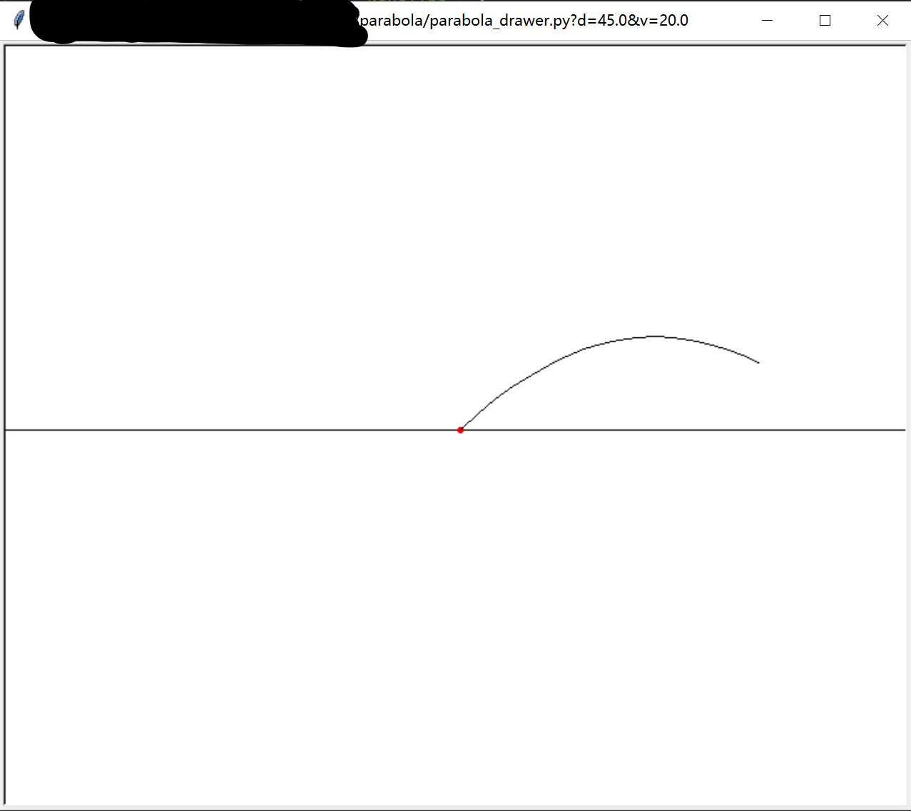
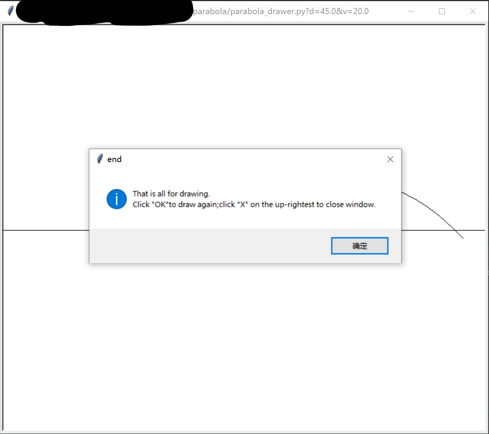
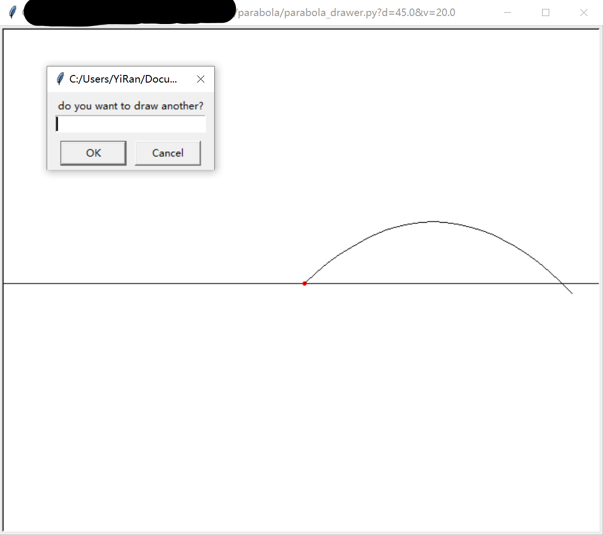

# Notes  
## as an app  
### ★Precautions  
First,you can neither edit 'number.txt' nor delete '__ init__.py'  
Second,it is import for you to read this article.  
### How to create a new parabola file?  
1.Run parabola_drawer.(Double click it in File Explorer)  
2.Wait for a few seconds(about 0.326s on average) because the computer will be getting ready for drawing at the moment.  
3.Enter the elevation('+'means right,'-'means left) you want the ball be in the input box,then click OK.<br/>  
4.Enter the speed you want the ball be in the input box,then click OK.<br/>  
5.Watch what it will happen.<br>  
6.When it ends,you will receive a prompt said drawing ended,and what you need to do is to click the button 'OK'.<br/>  
7.Then, if you want to draw another parabola, you can click 'OK'(->3);or you can click 'cancel' if you want to save the drawing(->8).<br/>  
8.After saving the picture,you can delete the picture.You can also open it with photoshop.  
<small>*By default,the app always save drawing,and always as an '.eps' file.  
**In order to protect developer information, we have blocked a part of the path in the illustration.</small>  

## as a module  
### Tips  
This module is based on `math` `os` `time` `turtle` and `tkinter`. If any of them is not in the directory 'Lib'(Location(usually) `C://Program Files/PythonXX/Lib`),you can enter these codes in pip(location: `AppData\Roaming\Python\Python39\site-packages\pip`) to download them:  
`math`:`pip install math`  
`os`:`pip install os`  
`time`:`pip install time`  
`turtle`:`pip install turtle`  
`tkinter`:`pip install pythotk`  

### Functions,Variables and Classes

#### Functions  
###### parabola.setting(name, value)  
name: used to describe which variable you want to set("g" or "f")  
value: used to describe what value you want to change the variable into  

eg.
```
print(g)
setting(name='g',
        value=9.9)
print(g)
```
The output will be:
```
9.8
9.9
```
###### parabola.get_version()  
return the version of parabola  
###### parabola.get_author()  
return the author of parabola  
###### parabola.get_copyright()  
return the information about the copyright of parabola  
###### parabola._main()  
run parabola_drawer app  
<small>You had better not use this function because using a function which start with single '_' outside the module does not follow the conventional python rules.</small>

#### Variables  
###### parabola.g  
Acceleration of gravity.  
You can change it by `parabola.setting("g",value)` if necessary.(For example,in the case of drawing parabolas on other planets.)  
###### parabola.f  
Frequency of analog refreshing.  
You can change it by `parabola.setting("f",value)` if necessary.(For example,in the case of simulation for scientific research.)  
<small>You had better not change it because high-frequency simulation requires a CPU with good performance, and even then it is still very harmful to the CPU.</small>
###### parabola.s
one of the `turtle.Screen()`  

#### Classes  
###### parabola.Item(direction, initial_speed, hide)  
an item that you want to throw  

> ## parameters  
> >### direction  
> >the elevation of the item when thrown
> 
> >### initial_speed
> >the speed of the item when thrown
> 
> >### hide
> >a boolean,describe if the item can be seen(False by default)

>## methods
> >### Item().throw()
> > Have no parameters.To start the drawing.

### We hope you can have a good time with parabola  

# Information  
```
v2.4.0-2021.1beta
Edit with python 3.9.1150.0 on Windows10
```
